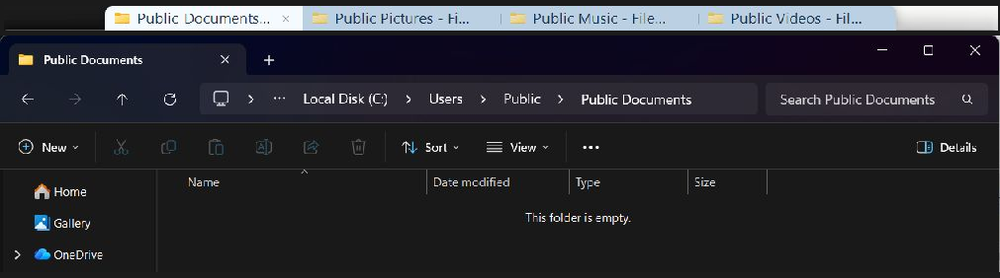
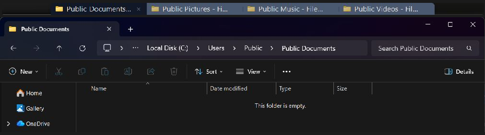
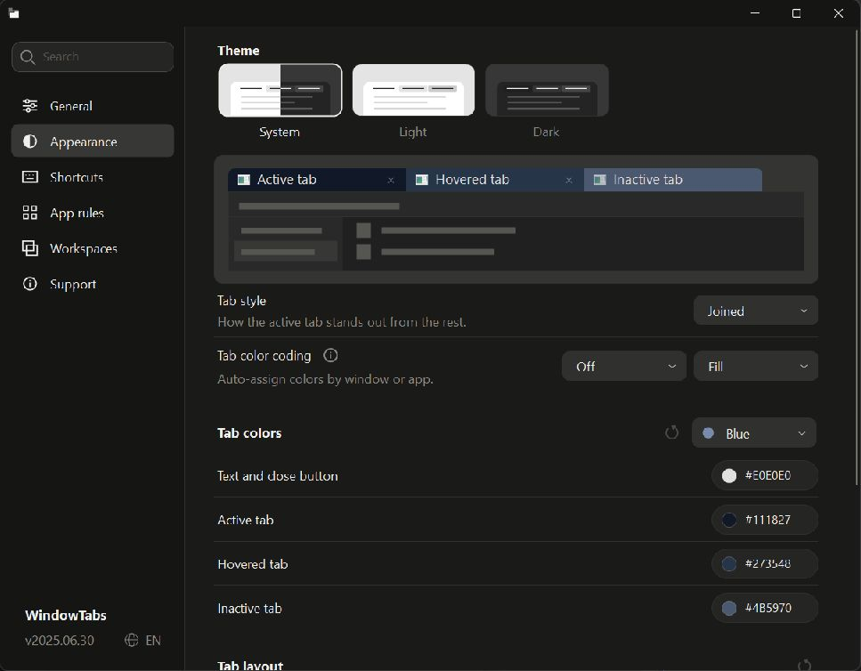

# WindowTabs

Browser-style tabs for your Windows desktop. Group separate windows into one tabbed
window, even when they belong to different apps.

[](https://github.com/leafOfTree/WindowTabs/releases)
[](https://github.com/leafOfTree/WindowTabs/actions/workflows/build.yml)

[Download](https://github.com/leafOfTree/WindowTabs/releases/latest) ·
[Getting started](#install-and-get-started) · [Shortcuts](#keyboard-and-mouse) ·
[What's changed](CHANGELOG.md)

**Light tabs**



**Dark tabs**



WindowTabs themes apply to the tab bar and Settings; your apps keep their own theme.
These screenshots and instructions describe the upcoming modernization release.
See [the changelog](CHANGELOG.md) for changes since v2025.06.30.

## Install and get started

You need **Windows 10 or 11** and **.NET Framework 4.8**. There is no installer;
the release download is a single `WindowTabs.exe`. You do not need Visual Studio or
the .NET SDK to use it.

1. Open [Releases](https://github.com/leafOfTree/WindowTabs/releases/latest) and download
   **WindowTabs.exe** from **Assets**.
2. Put it in a folder you plan to keep, such as `C:\Tools\WindowTabs`, then run it.
   WindowTabs stays in the system tray; check the tray's hidden icons if needed.
3. Open two separate File Explorer windows (**Ctrl + N** opens another window).
   WindowTabs adds a tab bar to eligible desktop windows.
4. **Drag one WindowTabs tab onto the other window's tab bar** to group them.
   Click a tab to switch. The grouped windows move, resize, minimize and restore together.
5. **Drag a tab away from the group** to separate that window again.

You can also group windows from different apps. WindowTabs groups desktop windows;
tabs built into File Explorer or a browser remain inside their own window.

Right-click a tab or the tray icon and choose **Settings**. On a fresh installation,
**Start with Windows** is enabled under **General**, so the app is ready after sign-in.
To stop WindowTabs, choose **Exit** from its tray menu; your application windows stay open.

## Make it yours

Start with the tab's right-click menu for changes to a window or app:

- **Rename tab**, choose a **Tab color**, or **Show icons only**.
- Turn off **Enable tabs for …** for an app that should keep its own windows.
- Enable **auto-grouping** for an app to put its new windows together automatically.
- Turn off **number shortcuts** for an app whose own Ctrl + number keys you use.
- Choose tab alignment or auto-hide behavior for the group.

Use Settings for the overall look and behavior. Its search box takes you directly
to a setting, and the language picker supports English, 中文 and 日本語.

| Page | What you can change |
| --- | --- |
| General | Startup, alignment, auto-hide, taskbar grouping and the optional Alt+Tab switcher |
| Appearance | Light/dark/system theme, tab style, colors, sizes and spacing |
| Shortcuts | Keyboard combinations, leader selection and mouse switching |
| App rules | Which apps get tabs and automatic grouping |
| Workspaces | Saved groups and window positions |
| Support | Settings backup, reset, release links, crash log and troubleshooting report |



**Tabs hide when maximized by default.** Move the pointer to the top edge to reveal
them; they also appear briefly after switching. Change **General → Auto-hide tabs**
to **Never** if you prefer to keep them visible.

Appearance includes **Joined**, **Folder** and **Floating** styles, color presets
and custom palettes. You can also assign colors automatically by window or app,
using a full tab fill or a thin stripe. Automatic colors, leader selection, hover
switching and the Alt+Tab replacement are off by default.

## Keyboard and mouse

These are defaults for a new installation. Existing custom shortcuts are retained.

| Action | Default |
| --- | --- |
| Next tab in the current group | Ctrl + Alt + → |
| Previous tab in the current group | Ctrl + Alt + ← |
| Search tabs by title or app | Ctrl + Alt + T |
| Open another window of the current tab's app | Ctrl + Alt + N |
| Select tab 1–9 in the current group | Ctrl + 1–9 |
| Switch tabs with the mouse | Scroll over the tab bar, or Shift + scroll over a grouped window |
| Leader selection | Off; when enabled, Alt + S followed by a selection key |

Change or clear keyboard shortcuts in **Settings → Shortcuts**. Direct number
shortcuts can use **Ctrl** or **Alt**; disable them for individual apps from the
tab menu if they conflict with that app.

For leader selection, enable **Use a leader key to select tabs**. Press **Alt + S**
and then the key shown on the tab you want. Choose `123456789`, `QWERTYUIOP`,
`ASDFGHJKL;`, or enter your own key sequence. Keys follow tab order; the active tab
keeps its position but has no badge. **Esc** cancels selection.

The optional Alt+Tab switcher offers icon and list views, and can show each group
as one item. Enable it under **General** if you want to replace Windows' switcher.

## Save a workspace

In **Settings → Workspaces**, save your current groups and positions. To restore
one later, open the apps you need first, select the saved workspace and choose
**Restore**. WindowTabs regroups matching open windows; it does not relaunch apps
or reopen their documents.

Title matching supports exact text, starts with, ends with, contains and regular
expressions, so a workspace can match windows whose titles change.

## Settings, portable use and updates

Changes save automatically. Settings normally live in
`%AppData%\WindowTabs\WindowTabsSettings.json`. **Support → Settings file** shows
the location in use and provides export, import and reset.

To use portable mode, export your settings as `WindowTabsSettings.json` beside
`WindowTabs.exe`, then restart. WindowTabs uses that file instead of the AppData
copy. Keep both files together when moving the app.

To update, download the new exe, **exit WindowTabs from the tray**, replace the old
exe and run it again. Keep your settings file. Older `WindowTabsSettings.txt`
settings are read when no JSON file exists and the original file is left untouched.
Click the version number in Settings to **Check Releases**; updates are installed
manually.

## Troubleshooting

- **No tabs on a window?** Check **App rules** to make sure tabs are enabled for
  its app. Dialogs, tool windows and some special windows are excluded.
- **Tabs disappeared after maximizing?** Reveal them at the top edge, or choose
  **General → Auto-hide tabs → Never**.
- **A shortcut conflicts with another app?** Change or clear it under
  **Shortcuts**. For Ctrl/Alt + number conflicts, use the tab menu's per-app option.
- **Something crashed?** Open **Settings → Support → Crash log**. Logs are written
  beside the exe, or to `%AppData%\WindowTabs` if that folder is read-only.

For help, [open an issue](https://github.com/leafOfTree/WindowTabs/issues) with steps
to reproduce the problem. Support can copy a troubleshooting report without window
titles, file paths or other personal information. Review screenshots and crash logs
for private content before sharing them.

## Build and contribute

WindowTabs is an F# WinForms app on .NET Framework 4.8. Building requires the
[.NET SDK](https://dotnet.microsoft.com/download) (tested with 10.0), or Visual Studio
2022/2026 with the **.NET desktop development** workload.

```powershell
git clone https://github.com/leafOfTree/WindowTabs
cd WindowTabs
dotnet build WindowTabs.sln -c Release
```

The standalone exe is `WtProgram\bin\Release\WindowTabs.exe`. Exit a running copy
before rebuilding its output. To run the regression suites on an interactive Windows
desktop:

```powershell
powershell -NoProfile -ExecutionPolicy Bypass -File tests/Run-Tests.ps1
```

Before changing code, read [AGENTS.md](AGENTS.md), [architecture](docs/architecture.md),
[testing](docs/testing.md), [settings](docs/settings-architecture.md) and
[performance](docs/performance.md). Run native UI suites serially. Desktop E2E takes
over real input; see [the desktop E2E guide](docs/desktop-e2e.md) before running it.

Pull requests trigger **build** and **hosted desktop E2E** checks. Merge only when
both pass on the **latest PR commit**. Build checks include Release compilation,
regression suites with 50% line/branch coverage floors, and Release smoke tests.
The modernization PR should describe the full runtime, UI, interop, tooling, test
and documentation scope, rather than only the most recent UI changes.

Maintainers: [publish a release from a version tag](docs/releasing.md).

## Credits and license

Created by Maurice Flanagan in 2009 and later open-sourced as
[mauricef/WindowTabs](https://github.com/mauricef/WindowTabs). This project continues
the work of [redgis](https://github.com/redgis/WindowTabs) and
[payaneco](https://github.com/payaneco/WindowTabs).

[MIT license](LICENSE).
