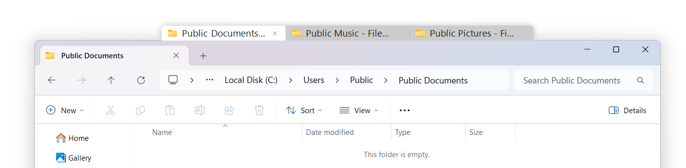
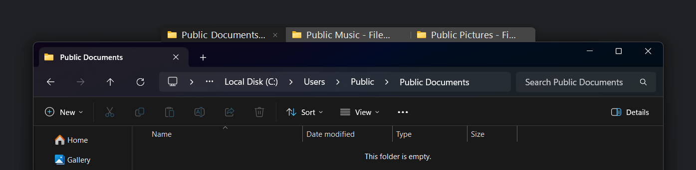
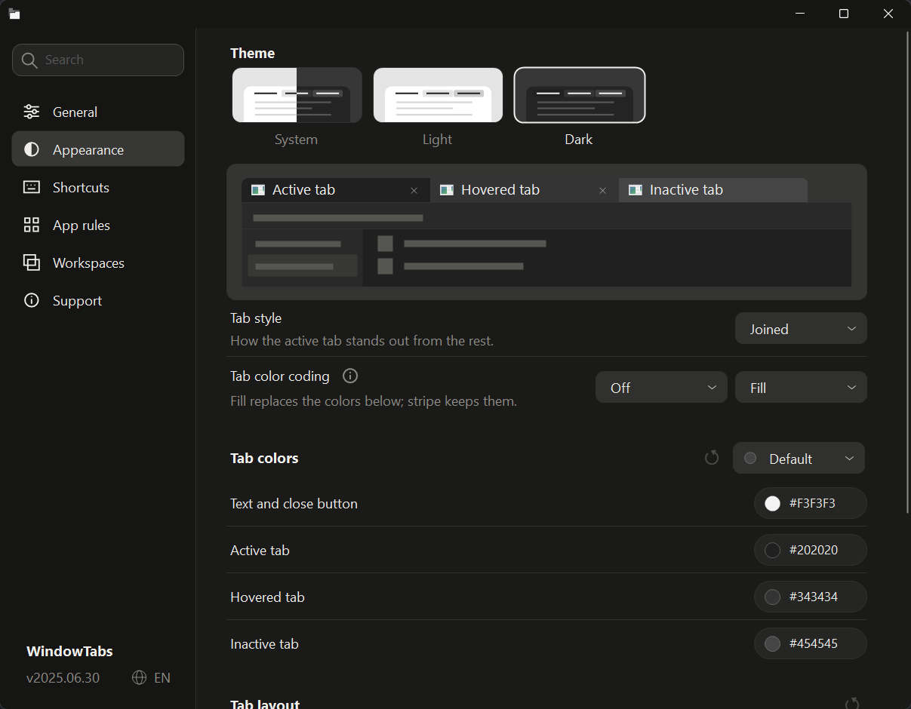

# WindowTabs

Browser-style tabs for your desktop windows. Group windows from any apps and switch
between them with a click or a shortcut.

[](https://github.com/leafOfTree/WindowTabs/releases)
[](https://github.com/leafOfTree/WindowTabs/actions/workflows/build.yml)

> [!IMPORTANT]
> **v2026.10.10 preview**: improved file drops, themed tab and tray menus, taskbar
> previews and tab switching. [What's changed →](CHANGELOG.md)





## Get started

Windows 10 and 11. No installation: download `WindowTabs.exe` from
[Releases](https://github.com/leafOfTree/WindowTabs/releases) and run it.
It runs in the system tray.

- **Group windows:** drag a tab onto another window's tab bar. Drag it away to ungroup.
- **Group an app automatically:** right-click its tab → **Enable auto-grouping**.
- **Settings:** right-click a tab or the tray icon.

Grouped windows move and resize together. Tabs hide on maximized windows; point at
the top edge to show them, or set **Auto-hide tabs** to **Never**.

## Shortcuts

| Action | Default |
| --- | --- |
| Next / previous tab | Ctrl + Alt + → / ← |
| Tab 1–9 | Ctrl + 1–9 (or Alt) |
| Search tabs | Ctrl + Alt + T |
| New window of the current app | Ctrl + Alt + N |
| Switch tabs with the mouse | Scroll over the tab bar, or Shift + scroll over the window |
| Move the current tab | Ctrl + scroll over the tab bar |
| Close a tab | Middle-click |

Change any shortcut under **Settings → Shortcuts**. If Ctrl/Alt + number conflicts
with an app, turn it off for that app from the tab's right-click menu.

**Optional, off by default:** switch on hover, a leader key to pick tabs by letter
(Alt + F, then the key on the tab), automatic tab colors, and an Alt+Tab replacement.

Drag files onto a tab and pause to bring that window forward. On a **File Explorer**
tab, let go to drop them into its folder as Explorer would: Ctrl copies, Shift moves,
right-drag asks, and **Ctrl + Z** in Explorer undoes it.

## Features

- **Appearance:** light, dark or follow Windows; Joined, Folder or Floating tabs;
  per-tab or per-app colors.
- **App rules:** choose which apps get tabs and which group automatically.
- **Workspaces:** save groups and window positions, then restore them onto open windows.
- **Taskbar:** optionally combine each group into one taskbar button.
- **Languages:** English, 中文, 日本語.

<a href="docs/images/settings.png"></a>

## Settings and updates

Settings save automatically to `%AppData%\WindowTabs\WindowTabsSettings.json`.
For portable use, put that file next to `WindowTabs.exe`.
Export, import and reset are under **Settings → Support**.

To update, exit WindowTabs from the tray and replace the exe. Settings are kept.

## Troubleshooting

- **No tabs on a window?** Check **Settings → App rules**. Dialogs don't get tabs.
- **Odd behavior after upgrading?** **Settings → Support → Reset to defaults**
  (your old settings are backed up first).
- **Run as administrator?** Not needed and not recommended. Windows blocks some
  input between admin and normal windows.
- **Dropping files on a tab does nothing?** Windows blocks dragging from an app into
  one running as administrator.

Still stuck? [Open an issue](https://github.com/leafOfTree/WindowTabs/issues) and paste
the troubleshooting report from **Settings → Support**. It leaves out window titles
and paths.

## Development

### Build and run

WindowTabs is an F# WinForms app on .NET Framework 4.8, with a small C# project for
Win32 interop. It builds on Windows with the
[.NET SDK](https://dotnet.microsoft.com/download) (tested with 10.0) or Visual Studio
2022+ with the **.NET desktop development** workload.

```powershell
git clone https://github.com/leafOfTree/WindowTabs
cd WindowTabs
dotnet build WindowTabs.sln                 # Debug: WtProgram\bin\Debug\WindowTabs.exe
dotnet build WindowTabs.sln -c Release      # single exe, as shipped
```

Exit WindowTabs from the tray before rebuilding; a running exe locks the output.

You can also open `WindowTabs.sln` in Visual Studio and start `WtProgram`.

AI-assisted contributions are welcome. Make sure you
understand and have tested your changes. See [AGENTS.md](AGENTS.md), [architecture](docs/architecture.md) and
[testing](docs/testing.md). 

### Things to know before changing code

- **Threads:** each tab group runs on its own UI thread, and the main thread owns
  settings and window discovery. Calls between them go through the adapters in
  `Shared/Services.fs`. Read [architecture](docs/architecture.md) before touching this.
- **UI text:** every visible string lives in `Shared/Strings.fs` with English, Chinese
  and Japanese. Machine translation is fine for a first draft; native speakers can refine it.
- **Settings:** names, defaults and ranges are declared once in
  `Shared/SettingsCatalog.fs`; the Settings window, search and reset all read from it.
- **DPI and themes:** use logical pixels and scale with `Dpi.scale`; check your UI in
  light, dark and high-contrast modes.


## Credits and license

Created by Maurice Flanagan in 2009 ([mauricef/WindowTabs](https://github.com/mauricef/WindowTabs)),
continued by [redgis](https://github.com/redgis/WindowTabs) and
[payaneco](https://github.com/payaneco/WindowTabs). [MIT license](LICENSE).
